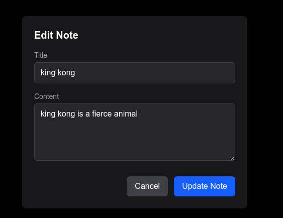
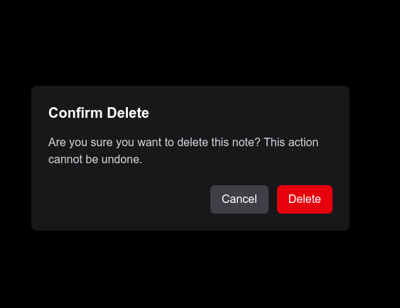
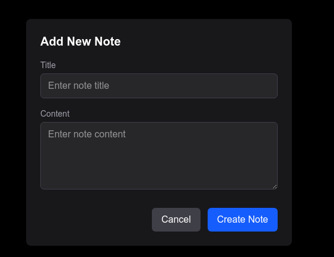
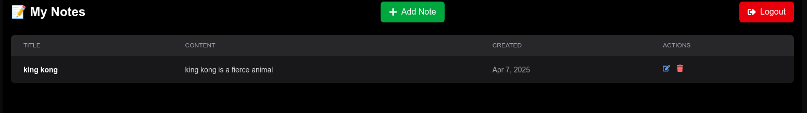
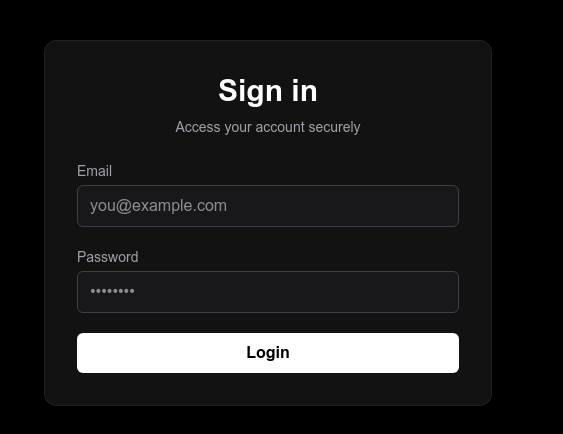

# 🐍 Python + ⚛️ Next.js Project Setup Guide

## 📦 Backend (Python / FastAPI)

### 1. Navigate to the Python project folder:
```bash
cd python

python3 -m venv .venv
source .venv/bin/activate

cd todo_app

pip install -r requirements.txt
uvicorn app.main:app --reload


## 📦 Frontend (next)

cd next
nvm use 23
npm install








